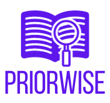
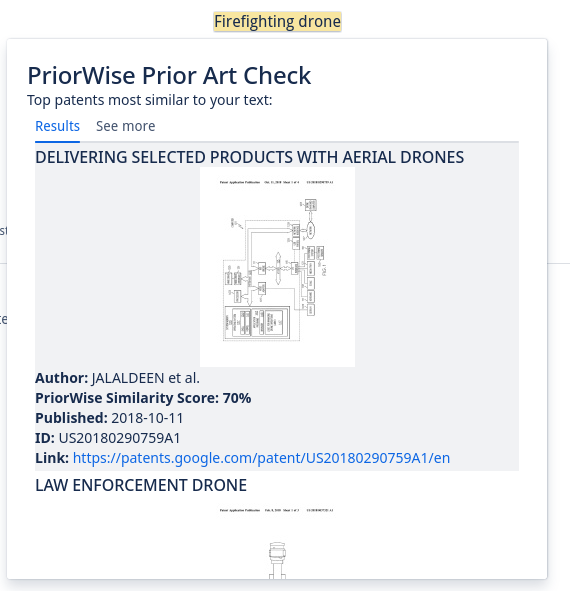

# PriorWise - AI Prior Art Search for Confluence
 [](https://www.javascript.com)



Thousands of companies, research groups, and innovators use Atlassian Confluence. They document ideas, research projects, experiments, and designs. PriorWise lets users search for prior art and research papers related to their ideas without needing to formulate a query or modify their text. PriorWise uses PQAI to intelligently parse the text the user selects or the full page they have written on Confluence, tokenizes the content, and then finds the most similar patents and research papers. The similarity is provided as a PriorWise Score, providing the similarity of the ideas as a percentage. Results are provided via the context menu, where users can simply highlight the text they wish to search, or from a content byline item which will search the entire page!



There are many reasons users will want to incorporate an AI prior art search in their workflows. Firstly, it helps to safeguard against potential legal issues. If your text inadvertently infringes on existing patents, you could face costly lawsuits and legal consequences. Secondly, it promotes innovation and ethical practices. By conducting thorough searches for prior art, you ensure that your work builds upon existing knowledge rather than replicating it, contributing positively to the progress of science and technology. Additionally, it enhances the credibility of your work. Demonstrating that you have conducted due diligence in searching for prior art and respecting intellectual property rights enhances your reputation as a responsible and ethical contributor to your field, fostering trust among peers and stakeholders. Ultimately, checking for patents and prior art is not only a legal requirement in many cases but also a responsible and ethical practice that benefits both creators and society at large.

## Requirements

See [Set up Forge](https://developer.atlassian.com/platform/forge/set-up-forge/) for instructions to get set up.

## Quick start

- Install to your Atlassian Confluence environment by followiing [this link](https://developer.atlassian.com/console/install/2a4cc90e-1bf5-412f-ad9b-bf4f0f86254b?signature=32e0eae444ce56f9eaafce643b936a0af77c3c4dfeecf1a02b926aceb5089971429e2975be2adb3eeac6c6640da015ddcad55281c31c9cddae7c75080b730d4c&product=confluence)

**OR TO BUILD AND DEPLOY YOURSELF:**

- Request a PQAI API token [here](https://projectpq.ai/get-involved/)

- Set the PQAI API Key as follows:
``````
forge variables set --encrypt PQAI_API_KEY your-key
export FORGE_USER_VAR_PQAI_API_KEY=your-key
``````

- Build and deploy the app by running:
```
forge deploy
```

- Install the app in an Atlassian site by running:
```
forge install
```

- To get logs and other debug information for the app run `forge tunnel` to proxy invocations locally (Note: you will need Docker installed):
```
forge tunnel
```